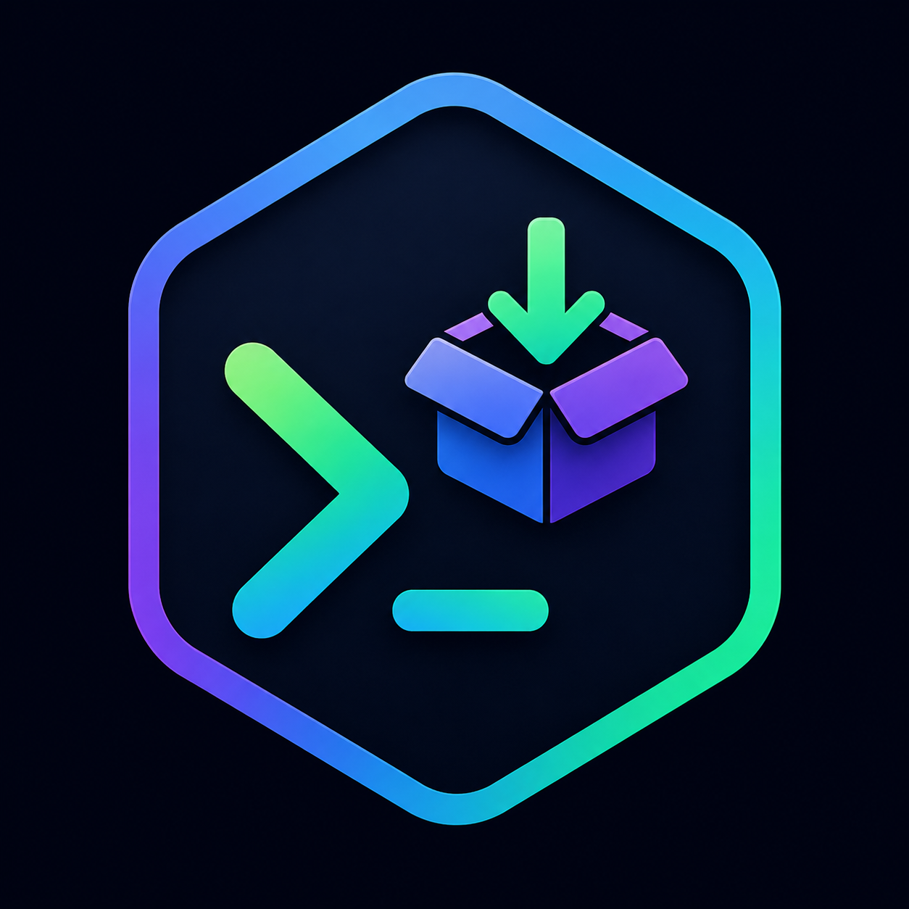
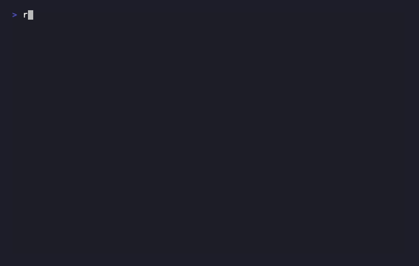
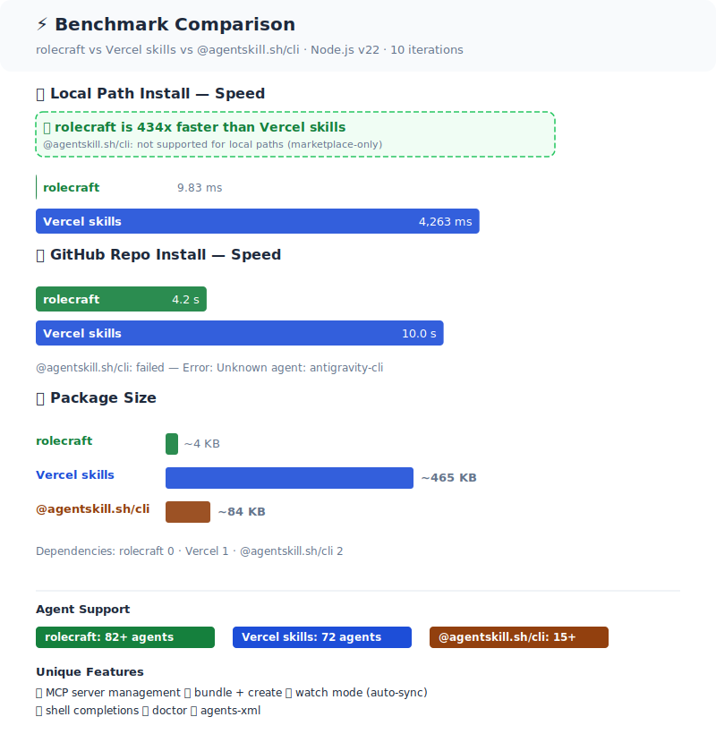

<p align="center">
  
</p>

<h1 align="center">RoleCraft</h1>

<p align="center">
  <b>Install AI agent skills as roles & behaviors — from any source.</b><br>
  Zero-dependency CLI. Skills + MCP servers. No marketplace. No signup.
</p>

<p align="center">
  <a href="https://awesome.re"></a>
  <a href="https://skills.sh/sametcelikbicak/rolecraft"></a>
  <a href="https://www.npmjs.com/package/rolecraft"></a>
  <a href="https://www.npmjs.com/package/rolecraft"></a>
  <a href="https://github.com/sametcelikbicak/rolecraft/actions/workflows/test.yml"></a>
  <a href="https://github.com/sametcelikbicak/rolecraft/actions/workflows/codeql.yml"></a>
  <a href="https://github.com/sametcelikbicak/rolecraft/blob/main/.github/dependabot.yml"></a>
  <a href="https://github.com/sametcelikbicak/rolecraft"></a>
  <a href="CHANGELOG.md"></a>
  <a href="CONTRIBUTING.md"></a>
  <a href="LICENSE"></a>
   <a href="https://sametcelikbicak.github.io/rolecraft/"></a>
   <a href="package.json"></a>
  <a href="docs/security.md"></a>
  <a href="CODE_OF_CONDUCT.md"></a>
  <a href="SUPPORT.md"></a>
</p>

<p align="center">
  <a href="https://www.producthunt.com/products/rolecraft?embed=true&utm_source=badge-featured&utm_medium=badge&utm_campaign=badge-rolecraft" target="_blank" rel="noopener noreferrer"></a>
</p>

<p align="center">
  Works with <b>82+ AI agents</b>: opencode · claude-code · cursor · windsurf · devin · codex · copilot · aider · cline · gemini-cli · cody · continue · warp · codeium · fabric · goose · tabnine · supermaven · pr-pilot · loom · roo · trae · hermes · kiro · augment · kilo · openhands · junie · factory · command-code · cortex · mistral-vibe · qwen-code · openclaw · codebuddy · mux · pi · autohand-code · rovo · firebender · bob · aider-desk · and more
</p>

<p align="center">
  <a href="#quick-start">Quick Start</a> ·
  <a href="#who-is-this-for">Who Is This For?</a> ·
  <a href="#features">Features</a> ·
  <a href="#commands-overview">Commands</a> ·
  <a href="#faq">FAQ</a> ·
   <a href="docs/security.md">Security</a> ·
   <a href="CONTRIBUTING.md">Contribute</a>
</p>

<p align="center">
  
</p>

---

<p align="center">
  <b>⚡ Zero dependencies</b> · <b>📦 4 KB</b> · <b>🤖 82+ agents</b> · <b>🔌 Skills + MCP</b> · <b>🔒 No telemetry</b> · <b>🌐 Offline-first</b> · <b>🔧 Any source</b>
</p>

<p align="center">
  <a href="benchmark/RESULTS.md"></a>
  <br>
  <a href="benchmark/RESULTS.md"><b>Full benchmark results →</b></a>
    
  <a href="docs/comparison.md"><b>Full feature comparison →</b></a>
    
  <a href="docs/migration-from-skills.md"><b>Migrate from Vercel skills →</b></a>
</p>

---

## Who is this for?

| If you... | rolecraft helps you... |
|-----------|----------------------|
| Use AI coding agents (Claude, Cursor, Copilot, etc.) | Install reusable skills so your agent stops re-learning your project every session |
| Maintain team conventions | Share a single skill repo across your whole team — no copy/paste |
| Run CI/CD pipelines | Lockfile-based `rolecraft ci` re-installs skills deterministically |
| Build agent skills | Scaffold, test, and distribute skills to 82+ agents from one source |
| Care about security | Built-in 0–100 security scoring blocks prompt injection, command injection, and credential harvesting on install |

---

## Onboarding: zero to productive in one command

New project? New team member? One command installs your skills + MCP servers + conventions to **every AI agent** on the machine:

```bash
# install globally
npm install -g rolecraft

# one command: detect all agents + install skill + MCP servers
rolecraft setup sametcelikbicak/task-decomposer
```

That's it. The skill is now active in every agent you use — opencode, cursor, claude-code, copilot, aider, all of them. [→ Full onboarding guide](docs/guides/onboarding.md)

## Quick start

```bash
# try without installing
npx rolecraft --help

# or install globally (works with npm, pnpm, yarn, bun)
npm install -g rolecraft

# create a skill
rolecraft init my-skill

# install it
rolecraft install ./my-skill                      # local folder
rolecraft install user/repo                       # GitHub repo
rolecraft install https://gitlab.com/org/project  # GitLab repo
rolecraft install git@github.com:user/repo.git    # SSH URL
rolecraft install npm:some-package                # npm package
rolecraft install npm:@scope/package@1.0.0        # npm with version
rolecraft install ./my-skill --cursor             # specific agent only

# install a skill with its MCP servers (declared in SKILL.md)
rolecraft install ./my-postgres-rules --cursor

# or manage MCP servers standalone
rolecraft mcp install npm:@modelcontextprotocol/github --cursor

# or install the rolecraft skill (teaches AI agents to use rolecraft)
npx skills add sametcelikbicak/rolecraft

# manage
rolecraft list
rolecraft search code-review
rolecraft check
rolecraft remove my-skill
```

**Requirements:** Node.js >= 20 · No other dependencies · 82+ agents supported · [Full install guide →](docs/install.md)

> **Why zero dependencies?** Every dependency is a risk — supply-chain attacks, breaking changes, bloated `node_modules`. rolecraft uses only Node.js built-in modules (`fs`, `path`, `crypto`, `https`). The entire CLI is ~4 KB. No `npm install` surprises.

---

## Features

- **Zero dependencies** — ~4 KB, no bloat
- **Any source** — local folder, GitHub/GitLab/Bitbucket repo, SSH git URL, npm package
- **MCP + Skills in one command** — install skills and their MCP servers together. No other CLI tool combines both.
- **82+ agents** — opencode, claude-code, cursor, copilot, aider, devin, gemini-cli, and more
- **skills.sh compatible** — installable via `npx skills add sametcelikbicak/rolecraft`
- **No registry required** — no signup, no marketplace, no vendor lock-in
- **Security scoring** — static analysis on install: detects prompt injection, command injection, obfuscated code, credential harvesting, and sensitive file access. Scores 0–100. Blocks dangerous skills unless `--yes`
- **Non-interactive mode** — `--yes` / `-y` flag for automation/CI pipelines
- **Update checking** — `rolecraft check` to see which skills have updates
- **Shell completions** — bash, zsh, fish auto-completion
- **TUI search** — interactive arrow-key skill browser with preview
- **Content hash verification** — detect tampered or outdated skills
- **CI-ready** — lockfile-based re-install for pipelines
- **Dry-run mode** — preview before installing
- **System health check** — `rolecraft doctor` diagnoses Node.js, agent directories, lockfiles, and skill integrity
- **AGENTS.md XML generation** — `rolecraft agents-xml` generates Claude Code-compatible `<skills_system>` XML for agent discovery

---

## Skills + MCP in one command

rolecraft is the **only CLI** that installs both agent skills and MCP servers together.

When a SKILL.md declares MCP servers in its frontmatter:

```yaml
---
name: postgres-rules
mcp_servers:
  - name: postgres
    source: npm:@modelcontextprotocol/postgres
---
```

`rolecraft install ./postgres-rules --cursor` installs the skill and the MCP server — one command, no separate tools.

You can also manage MCP servers standalone:

```bash
rolecraft mcp install npm:@modelcontextprotocol/github --cursor
rolecraft mcp list
rolecraft mcp remove postgres
```

[→ Full MCP documentation](docs/mcp.md)

---

## Commands overview

| Command                                 | Description                                                                 | Details                              |
| --------------------------------------- | --------------------------------------------------------------------------- | ------------------------------------ |
| `rolecraft init [<name>]`               | Scaffold a new `SKILL.md`                                                   | [docs](docs/commands/init.md)        |
| `rolecraft install <source>`            | Install a skill with security scan (local path, GitHub/GitLab/SSH URL, npm) | [docs](docs/commands/install.md)     |
| `rolecraft bundle <sources>`            | Install multiple skills from inline sources or file                         | [docs](docs/commands/bundle.md)      |
| `rolecraft bundle create`               | Create a new bundle file                                                    | [docs](docs/commands/bundle.md)      |
| `rolecraft search <query>`              | Search for skills on GitHub (TUI with `--interactive`)                      | [docs](docs/commands/search.md)      |
| `rolecraft check`                       | Check installed skills for available updates                                | [docs](docs/commands/check.md)       |
| `rolecraft use <source>`                | Preview a skill's files without installing                                  | [docs](docs/commands/use.md)         |
| `rolecraft completions bash\|zsh\|fish` | Generate shell completion scripts                                           | [docs](docs/commands/completions.md) |
| `rolecraft setup [<source>]`            | Detect agents, optionally install a skill to all                            | [docs](docs/commands/setup.md)       |
| `rolecraft list`                        | Show all installed skills                                                   | [docs](docs/commands/list.md)        |
| `rolecraft doctor`                      | Run system health check                                                     | [docs](docs/commands/doctor.md)      |
| `rolecraft agents-xml [--write]`        | Generate skills XML for AGENTS.md                                           | [docs](docs/commands/agents-xml.md)  |
| `rolecraft mcp install/remove/list`     | Install, remove, and list MCP servers for AI agents                         | [docs](docs/commands/mcp.md)         |
| `rolecraft profile save/apply/list`     | Save, apply, and share multi-agent configuration profiles                   | [docs](docs/commands/profile.md)     |
| `rolecraft verify`                      | Check installed skill integrity via content hash                            | [docs](docs/commands/verify.md)      |
| `rolecraft watch [<slug>]`              | Watch skills for changes and auto-sync                                     | [docs](docs/commands/watch.md)       |
| `rolecraft ci`                          | Re-install all skills from lockfile (CI mode)                               | [docs](docs/commands/ci.md)          |
| `rolecraft upgrade`                     | Upgrade rolecraft to the latest version                                     | [docs](docs/commands/upgrade.md)     |
| `rolecraft remove <slug>`               | Uninstall a skill                                                           | [docs](docs/commands/remove.md)      |
| `rolecraft update <slug>`               | Re-install a skill to latest                                                | [docs](docs/commands/update.md)      |
| `rolecraft --version`                   | Show version                                                                |                                      |

---

## Why rolecraft?

[→ Full feature comparison](docs/comparison.md)

| Feature                              | rolecraft        | skills (Vercel) | @agentskill.sh/cli  |
| ------------------------------------ | ---------------- | --------------- | ------------------- |
| Zero dependencies                    | ✅ **0**         | ✅ (1 dep)      | ❌ (2)              |
| Local path install                   | ✅ **1st class** | ✅              | ❌ marketplace only |
| GitHub repo install                  | ✅               | ✅              | ❌                  |
| GitLab / SSH git URL                 | ✅               | ✅              | ❌                  |
| npm package source                   | ✅               | ✅              | ❌                  |
| **MCP server management**            | ✅               | ❌              | ❌                  |
| Agent targets                        | **82**           | 72              | 15+                 |
| Skills.sh listed                     | ✅               | ✅              | ⚠️ (registry only)  |
| Bundle install + create              | ✅               | ❌              | ✅ (skillset only)  |
| Interactive TUI search + install     | ✅               | ✅              | ❌                  |
| Security scoring (0–100)             | ✅               | ✅ (Snyk)       | ✅ (server + local) |
| Non-interactive flag (`--yes`/`-y`)  | ✅               | ✅              | ❌                  |
| Skill update check (`check`)         | ✅               | ❌              | ❌                  |
| Shell completions (bash/zsh/fish)    | ✅               | ❌              | ❌                  |
| Dry-run preview (`--dry-run`)        | ✅               | ❌              | ❌                  |
| Interactive scope prompt             | ✅               | ✅              | ❌                  |
| Content hash verification (`verify`) | ✅               | ✅              | ❌                  |
| CI-mode re-install (`ci`)            | ✅               | ✅              | ❌                  |
| System health check (`doctor`)       | ✅               | ❌              | ❌                  |
| Watch mode (auto-sync)               | ✅               | ❌              | ❌                  |
| AGENTS.md XML generation             | ✅               | ❌              | ❌                  |
| Self-upgrade command                 | ✅               | ❌              | ❌                  |
| File size                            | ~4 KB            | ~465 KB         | ~84 KB              |

[See full table →](docs/comparison.md)

---

## Security

Every install is automatically scanned with **static analysis** that detects:

| Severity | What it catches |
|----------|----------------|
| 🔴 Critical | Prompt injection, obfuscated code (base64 blobs, `eval()`), command injection (download-and-execute) |
| 🟡 High | Credential harvesting patterns, sensitive file access (`~/.ssh`, `.env`) |
| 🟢 Medium/Low | Missing metadata, unusual source patterns |

Scores range **0–100**:
- **90+** → SAFE, install proceeds
- **70–89** → REVIEW, prompts for confirmation
- **<70** → DANGER, blocked unless `--yes`

```bash
rolecraft install ./my-skill              # auto-scanned
rolecraft install ./my-skill --yes        # force install even if DANGER
```

[→ Full security documentation](docs/security.md)

---

## How agents discover skills

rolecraft knows where each AI agent looks for skills. Use flags like `--claude`, `--cursor`, `--devin` to target specific agents, or `--all` for every supported agent.

[→ Full agent path table](docs/agents.md)

```bash
# Install to multiple agents at once
rolecraft install ./my-skill --cursor --devin --copilot --gemini --cody
```

---

## Architecture

1. Reads `SKILL.md` from the source and parses metadata (slug, name, owner)
2. Runs a **security scan** on all skill files — checks for prompt injection, command injection, obfuscated code, credential harvesting, and sensitive file access. Scores 0–100. Blocks dangerous skills unless `--yes`
3. Copies (or symlinks with `--symlink`) all files alongside `SKILL.md` to the target directory
4. Computes a SHA256 content hash and stores it in the lockfile
5. Updates `~/.agents/.skill-lock.json` so agents can discover the skill
6. Compatible with skills installed by `@agentskill.sh/cli`, `add-skill`, or manual installs
7. Installable as a skill itself via `npx skills add sametcelikbicak/rolecraft`

[→ Full architecture & project structure](docs/architecture.md)

---

## FAQ

**Q: Do I need to sign up or log in?**
A: No. No account, no API key, no marketplace. Point rolecraft at any folder or repo and it works.

**Q: Can I use rolecraft with multiple AI agents?**
A: Yes. 82+ agents supported. Use `--cursor`, `--claude`, `--devin` flags or `--all` for every agent.

**Q: Does rolecraft send telemetry?**
A: No. Zero data leaves your machine. The security scan runs locally. No phone home.

**Q: How is this different from `npx skills` (Vercel)?**
A: rolecraft has zero dependencies, MCP server management, 82 agents (vs 72), `doctor`, `watch`, `bundle`, `agents-xml`, and shell completions. [Full comparison →](docs/comparison.md)

**Q: Can I use it in CI/CD?**
A: Yes. `rolecraft ci --yes` re-installs all skills from lockfile, non-interactive. Perfect for pipelines.

**Q: My skill is blocked as DANGER. What do I do?**
A: Review the security report, fix the flagged patterns, or use `--yes` to force install (not recommended for untrusted skills).

## Development

Clone the repo and test locally without publishing to npm:

```bash
git clone https://github.com/sametcelikbicak/rolecraft.git
cd rolecraft

# link globally
npm link

# now `rolecraft` runs from your local checkout
rolecraft --help

# for the docs site (VitePress)
npm install
npm run docs:dev        # local preview at http://localhost:5173/rolecraft/
npm run docs:build      # production build to docs/.vitepress/dist/

# unlink when done
npm unlink -g rolecraft
```

All commands work the same as the installed version. No npm publish needed.

## Support

- **[Docs site](https://sametcelikbicak.github.io/rolecraft/)** — full command reference and guides
- **[GitHub Issues](https://github.com/sametcelikbicak/rolecraft/issues)** — bug reports, feature requests
- **[SUPPORT.md](SUPPORT.md)** — how to get help
- **[SECURITY.md](SECURITY.md)** — responsible disclosure

## Contributing

Contributions are welcome! See [CONTRIBUTING.md](CONTRIBUTING.md) for guidelines on how to get started. Before opening an issue, check our [templates](.github/ISSUE_TEMPLATE/) for bug reports and feature requests.

### Contributors

Thanks to everyone who has contributed to RoleCraft:

| Avatar                                                                                          | Name                                                   | Role                                                                |
| ----------------------------------------------------------------------------------------------- | ------------------------------------------------------ | ------------------------------------------------------------------- |
|  | [Samet ÇELİKBIÇAK](https://github.com/sametcelikbicak) | Owner & Maintainer                                                  |
|              | [冯基魁](https://github.com/fengjikui)                 | [Contributor](https://github.com/sametcelikbicak/rolecraft/pull/62) |

## License

MIT
